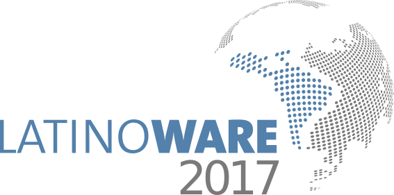
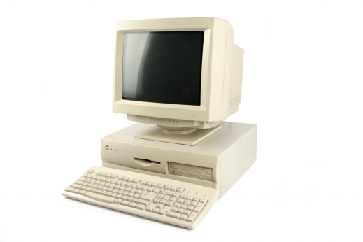

### Dev 4 Ops
####  Diego Neves
#####  diego@diegoneves.eti.br:

---
###  Sumário
1. ~$ whoami 
2. História
3. Não tão história assim
4. Presente
5. E o que vamos falar nessa palestra?
6. Futuro

---
### ~$ whoami
* Consultor de Tecnologia,
* Especialista em Redes de Computadores,
* Bacharel em Sistemas de Informação,
* Trabalho com Software Livre desde 2006,
* Membro do time de tradução do Debian para pt_BR,
* Amante de um bom Rock n’ Roll e boas cervejas.

---
###  História
Nos primórdios da informática, existia “pouca especialização” Muito dev cuidando de servidores ou muito ops desenvolvendo sistema.

---
###  Não tão história assim
Com o grande crescimento da TI, começou a surgir funções mais específicas, inclusive com a separação de DEV e OPS.

---
###  Presente
Atualmente já temos várias ferramentas que automatizam tarefas, o que inclusive criou (ou renomeou) um novo termo, DevOps. 

---
###  E o que vamos falar nessa palestra?
Todo mundo sabe, ou pelo menos deveria, que não existe um “Profissional DevOps”, um “Setor DevOps” ou coisas assim, DevOps é uma cultura que deve ser implementada no ambiente.

--
Ferramentas de orquestração são realmente uma mão na roda, evita por exemplo, erro humano, o que também é conhecido como "Na minha maquina funciona"

--
Mas, esse não é o objetivo dessa palestra.

--
### Show me The Code.

---
### Futuro
Num futuro muito próximo, amanhã, pra ser mais exato:
* Às 10:00 horas, no Espaço Chile, A palestra do Christiano (Linuxmen): "DevOps: A Revolução ruidosa da TI".
* Às 15:00 Horas, bem depois da Foto Oficial, a palestra do Rafael Gomes (Gomex): "Cansei de trabalho manual, quero automatizar tudo.".

