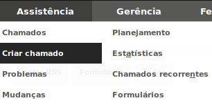

### GLPI
#### Modulo Assistencia
#####  Diego Neves
######  diego@diegoneves.eti.br:

---
###  Sumário
1. Assistencia
	1. Chamados 
	2. Criar Chamado
	3. Problemas 
	4. Mudanças
	5. Planejamento
	6. Estatisticas
	7. Chamados Recorrentes
	8. Formularios

---
### Chamados

--
#### Chamados

--
#### Chamados
Nesta tela podemos:
* Buscar chamados por:
	* Status;
	* Requerente (Usuário ou Grupo);
	* Tecnico (Usuário ou Grupo);
	* Localização;

--
#### Chamados
* As buscas podem ser filtradas de acordo com campo:
	* É (Igual - ==)
	* Não É (Diferente - !=)
	* Antes (Para tempo - Antes de uma data)
	* Depois (Para tempo - Depois de uma data)
	* Contém  (Para texto - Uma parte do texto - LIKE "%TEXTO%")

--
#### Chamados
Outro ponto forte nos filtro é a possibilidade de poder usar varios filtros ao mesmo tempo;
Ex: Chamados não Solucionados/Fechados e com data anterior a 7 dias.

---
### Criar Chamado

--
#### Criar Chamado
Neste menu podemos criar novos chamados, lembrando que a visão do "Técnico" é diferente da visão do "usuário".
Tendo a visão do usuário, uma interface mais simplificada.

--
Na tela de abertura de chamados, temos as seguintes áreas:
* Na primeira parte, tudo referente âs datas, Data de Abertura, SLA de aceite, SLA de Solução, OLA e tipo e categoria de chamado.
	Vamos falar sobre OLA e SLA em breve.

* Um pouco mais em baixo, temos os dados sobre os Atores, Requerente, Observador e Atribuido. Onde podem ser selecionados usuários e grupos.

--
Os próximos campos são relacionados ao chamado em si, como status, origem, localização, equipamentos associados, etc.

Logo abaixo, temos os campos para inserir a requisição, como título, descrição, chamados relacionados e arquivos.
