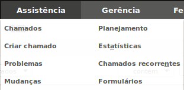
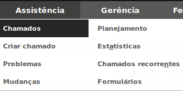
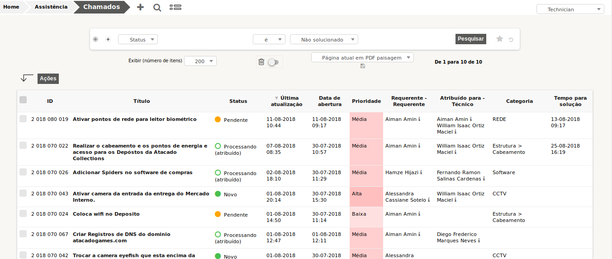
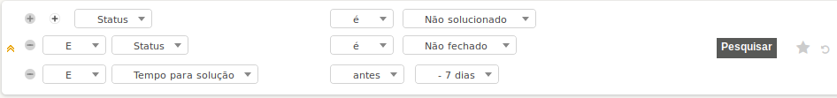

### GLPI
#### Modulo Assistencia
#####  Diego Neves
######  diego@diegoneves.eti.br:

---
###  Sumário
1. Assistencia
	1. Chamados 
	2. Criar Chamado
	3. Problemas 
	4. Mudanças
	5. Planejamento
	6. Estatisticas
	7. Chamados Recorrentes
	8. Formularios

---
### Chamados

--
#### Chamados

--
#### Chamados
Nesta tela podemos:
* Buscar chamados por:
	* Status;
	* Requerente (Usuário ou Grupo);
	* Tecnico (Usuário ou Grupo);
	* Localização;

--
#### chamados
* As buscas podem ser filtradas de acordo com campo:
	* É (Igual - ==)
	* Não É (Diferente - !=)
	* Antes (Para tempo - Antes de uma data)
	* Depois (Para tempo - Depois de uma data)
	* Contém  (Para texto - Uma parte do texto - LIKE "%TEXTO%")

--
#### Chamados
Outro ponto forte nos filtro é a possibilidade de poder usar varios filtros ao mesmo tempo;
Ex: Chamados não Solucionados/Fechados e com data anterior a 7 dias.

