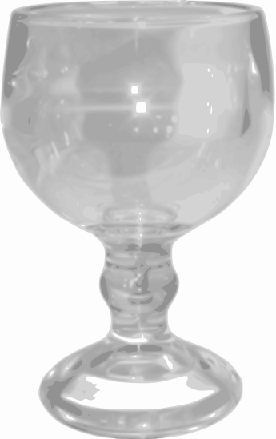
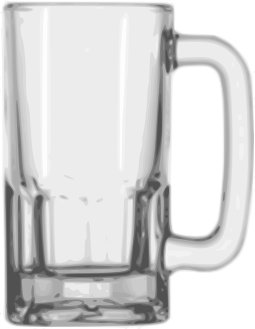
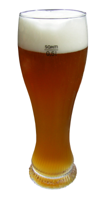

### Um bom bate-papo sobre Cerveja
####  Diego Neves
#####  diego@diegoneves.eti.br:

---
###  Sumário
1. ~$ whoami 
2. História
3. Ingredientes
4. Preparação
5. Estilos de Cervejas
6. Classificação das Cervejas
7. Copos de Cerveja
8. Armonizações

---
### ~$ whoami
* Consultor de Tecnologia,
* Especialista em Redes de Computadores,
* Bacharel em Sistemas de Informação,
* Trabalho com Software Livre desde 2006,
* Membro do time de tradução do Debian para pt_BR,
* Amante de um bom Rock n’ Roll e boas cervejas.

---
###  História
####  Cerveja
A cerveja é uma bebida produzida a partir da fermentação de cereais, principalmente a cevada maltada. Acredita-se que tenha sido uma das primeiras bebidas alcoólicas que foram criadas pelo ser humano. Atualmente, é a terceira bebida mais popular do mundo, logo depois da água e do chá. É a bebida alcoólica mais consumida no mundo atualmente.

---
####  Timeline
#####  Antes de 6000 a.C
A Cerveja já era conhecida na Suméria, Egito, Mesopotânia e Penisula Ibérica.

#####  2600 - 2350 a.C
Noticia mais antiga sobre cerveja, foram encontradas por arqueologos o "Hino de Ningasi", foram encontrados diversos registros de que, na Babiônia, existiam diversos tipos de cervejas, originadas de diversas combinações de plantas e aromas, alem do uso de diversas quantidades de mel.

--
#####  1760 a.C
Criação da Estela de Hamurabi, Primeia lei de regulamentação da prudução e venda de Cerveja.
* No código de Hamurabi continham os direitos e deveres dos clientes das tabernas, além da pena de morte para quem não respeitava os criterios de produção e consumo da bebida.
* Estabelecia ainda, uma cota dirária de cerveja, sendo:
	* 2 Litros para os trabalhadores;
	* 3 Litros para os funcionários publicos;
	* 5 Litros para administradores e sacerdotes.

--
#####  1184 - 1153 a.C
No antigo Egito, a cerveja era pruduzida para ajudar a quem não tinha como pagar pelo vinho, como conta o escritor grego Ateneu de Náucratis no seculo III d.C. Porem, outros estudos mostram que a cerveja era consumida por todas as camadas sociais, inclusive pelo Faraó Ramsés III, que passou a ser conhecido como o "Faraó-Cervejeiro", que doou aos sacerdotes aproximadamente 1 milhão de litros de cerveja produzida por suas cervejarias.

--
#####  700 - 800 d.C
Na Idade Média, a cerveja era produzida por vários mosteiros, que empregavam diversas ervas para aromatização, como mirica, louro, salvia e o lúpulo.
* O uso do Lupulo é atribuido aos monges do mosteiro de San Gallo, que utilizavam para dar o amargor, alem de ter um fator importantissimo na conservação

--
##### 1516 d.C
Reinheitsgebot, ou Lei de Pureza Alemã foi promulgada pelo duque Guilherme IV, da Baviera, instituindo que a cerveja deveria ser fabricada apenas com Água, Malte de Cevada e Lúpulo, pois ainda não se tinham o conhecimento da Levedura de Cerveja:

--
######  Texto da Reinheitsgebot
Proclamamos com este decreto, por Autoridade de nossa Província, que no Ducado da Baviera, bem como no país, nas cidades e nos mercados, as seguintes regras se aplicam à venda da cerveja:
Do dia de São Miguel (29 de Setembro) ao dia de São Jorge (23 de abril), o preço para um Litro ou um Copo, não pode exceder o valor de Munique do pfennig.
--
Do dia de São Jorge (23 de Abril) ao dia de São Miguel (29 de setembro), o litro não será vendido por mais de dois pfennig do mesmo valor, e o copo não mais de três Heller.
Se isto não for cumprido, a punição indicada abaixo será administrada.
--
Se todo cervejeiro tiver outra cerveja, que não a cerveja do verão, não deve vendê-la por mais de um pfennig por Litro.
Além disso, nós desejamos enfatizar que no futuro em todas as cidades, nos mercados e no país, os únicos ingredientes usados para fabricação da cerveja devem ser lúpulo, malte e água.
Qualquer um que negligenciar, desrespeitar ou transgredir estas determinações, será punido pelas autoridades da corte que confiscarão tais barris de cerveja, sem falha.
--
Se, entretanto, um comerciante no país, na cidade ou nos mercados comprar dois ou três barris da cerveja (que contém 60 litros) para revendê-los ao vendedor comum, apenas para este será permitido acrescentar mais um Heller por copo, do que o mencionado acima. Além disso, deverá acrescentar um imposto e aumentos subsequentes ao preço da cevada (considerando também que os tempos da colheita diferem, devido à localização das plantações).
--
Nós, o Ducado da Baviera, teremos o direito de fazer apreensões para o bem de todos os interessados.

--
#####  Seculo XVI
Os primeiros tipos de cerveja, unicos até tempos relativamente recentes, é o hoje chamamos de "Ales", apenas no seculo XVI surgiram, por acidente, as Lagers, que desde então, são os tipos mais consumidos no mundo atualmente.

---
####  Ingredientes
Basicamente, a cerveja é constituida de Água, uma fonte de amido, como o malte de cevada, uma levedura, que será responsável pela fermentação e lúpulo.
(NÃO) Pode se usar também, fontes de amido secundária, como milho ou arroz, visando baratear o custo da cevada de maltada. Em alguns casos, são encontrados milheto, sorgo e raiz de mandioca, na Africa, batata, no Brasil e agave no México.

--
##### Água
Diferente do que se imagina, a água não é a mesma em todos os lugares do mundo, tendo a água de cada região, compóstos minerais diferentes.

--
##### Malte de Cevada

--
##### Lúpulo

--
##### Levedura ou Fermento

---
#### Preparação

---
#### Estilos de Cervejas

---
#### Classificação das Cervejas

---
#### Copos de Cerveja
Assim como nos vinhos, cada tipo de cerveja tem um tipo de copo especifico para seu consumo, isso porque, assim que a cerveja entra em contato com o ambiente, todas as propriedades, cor, sabor e aromas são alterados e cabe ao copo, a função de manter as caracteristicas de cada tipo. Alguns copos por exemplo, tem um formato que propicia uma maior formação e retenção da espuma, que funciona como uma barreira para evitar que o aroma evapore, alem de auxiliar na conservação da temperatura.

--
Ideais para cervejas do tipo Faro, Lambic, Gueuze e as champegnoises, o formato esguio faz com que o creme demore mais para se dissipar, prolongando as qualidades da cerveja.

--
Projetado para mater a espuma, é utilizado por cervejas da escola belga. como as Dubbel, Tripel e Quadrupel, podem conter ranhuras na parte inferior para manter a produção de espuma constante, além de boca larga para os goles mais profundos.

--
Ideal para certejas com espuma mais cremosa, como as Strong Ales, aumenta e captura os compostos voláteis, induzindo grandes colarinhos. muito utilizado para cervejas mais aromaticas.

--
Geralmente cilindricos, ou com pouca inclinação, costumam ter um tamanho padrão (16Oz e 20Oz) são muito utilizados para cervejas dos tipos Bitter e Stout

--
Um dos copos mais comuns no universo Cervejeiro, capiturando a efervescência e as cores de uma Pilsen. mantem a espuma e melhora a percepção dos compostos volateis. É adecuado para os tipos mais consumidos de cerveja, como as Viena Larger, American Lager e Pilsner.

--
Popularizado graças as festas cervejeiras na Alemanha, possue vários tamanhos e no geral, comportam uma grande quantidade de cerveja, são utilizados para diversos tipos diferentes, como as Amber ales, Bock, Pilsener, Munich, OktoberFest, etc.

--
Produzido para armazenar o conteudo completo da garrafa, incluindo a espuma, além de reter os aromas, é utilizado para os estilos varios estilos de Weissbier, como as Dunkelweizen, Hefeweizen, Kristalweizen, Weizenbock.

---
#### Armonizações

---
#### Agradecimentos

